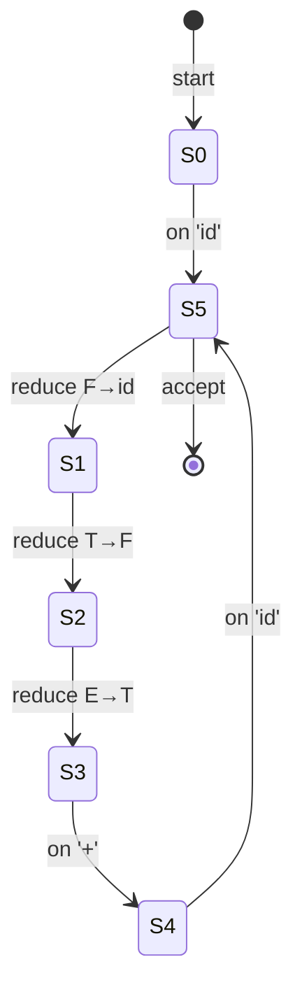

# LALR(1) Parsing Explained (Beginner-Friendly)

## 🧠 What Is LALR(1) Parsing?

**LALR(1)** stands for:

> **Look-Ahead LR with 1 token of lookahead**

It’s a type of **bottom-up parser**, meaning it **starts from the input tokens** and works **upward** toward building the syntax tree that represents the program’s grammar.

It’s one of the most **common parser types** used in programming language compilers (e.g., Yacc, Bison).

---

## 🌳 The Big Picture: Parsing Pipeline

```
source code
   ↓
tokenizer (lexer)
   ↓
sequence of tokens
   ↓
parser (LALR(1))
   ↓
abstract syntax tree (AST)
```

**Goal:** Determine if the token sequence follows the grammar and build the AST.

---

## 📘 Example Grammar

```
E → E + T | T
T → T * F | F
F → (E) | id
```

This describes simple arithmetic with addition, multiplication, and identifiers.

---

## 🧩 Step 1: LR(0) Items

An **LR item** is a grammar rule with a “dot” (·) showing how much we’ve recognized.

Example:

```
E → E · + T   // means we’ve parsed the left E and now expect "+"
```

The parser builds **states** based on these items.

---

## 🧱 Step 2: Building States (Simplified Idea)

Each **state** represents possible parser situations.

| State | Meaning Example |
|--------|-----------------|
| S0 | starting point: we expect an `E` |
| S1 | we have parsed `E`, maybe see `+` next |
| S2 | we are parsing `T` |
| S3 | we have parsed `F`, may see `*` next |

Each state defines what **actions** to take:
- **Shift**: read the next token
- **Reduce**: apply a rule (collapse right-hand side to left-hand side)
- **Goto**: move to a new state after reduction

---

## ⚙️ Step 3: Add Lookahead (LALR(1))

The **“(1)”** means:
> The parser looks **1 token ahead** to decide what to do.

Without lookahead, you might have ambiguity like this:

```
E → E + T | T
T → T * F | F
```

If you see `id`, should we reduce `F → id` or wait for a `*` or `+`?  
The **lookahead token** (like `+` or `*`) helps decide.

---

## 🪜 Step 4: Merge States (LALR Optimization)

The **LALR** version merges similar **LR(1)** states that only differ in lookahead sets.

This reduces the number of states — **more efficient** but still **unambiguous** for most programming languages.

---

## 🧮 Step 5: Example Parsing Walkthrough

Let’s parse:  
```
id + id * id
```

### Tokens
```
[id, +, id, *, id]
```

### Simplified Parse Table Actions
| State | Token | Action |
|--------|--------|--------|
| S0 | id | Shift → S5 |
| S5 | + | Reduce F→id |
| S3 | + | Reduce T→F |
| S1 | + | Shift + |
| ... | ... | ... |

*(The actual table is large, but tools like Yacc/Bison generate it automatically.)*

---

## 🧩 Pseudo-Code (Simplified Parser Loop)

```pseudo
stack = [0]  // initial state
input = tokens + [EOF]

while true:
    state = top(stack)
    token = peek(input)
    action = parse_table[state, token]

    if action == "shift s":
        push(token)
        push(s)
        consume(input)

    else if action == "reduce A → β":
        pop(2 * len(β))   // remove symbols and states
        t = top(stack)
        push(A)
        push(goto_table[t, A])

    else if action == "accept":
        print("Parsing successful")
        break

    else:
        error("Unexpected token: " + token)
```

---

## 🌲 Mermaid Diagram: LALR(1) State Flow (Simplified)



This is highly simplified but gives the sense of **state transitions** and **reductions**.

---

## 🧭 Summary

| Concept | Meaning |
|----------|----------|
| **LR** | Left-to-right scan, Rightmost derivation in reverse |
| **LALR(1)** | Optimized LR(1) with merged states, 1-token lookahead |
| **Advantage** | Efficient, deterministic, good for most programming languages |
| **Used in** | Yacc, Bison, Menhir, Go’s `go tool yacc`, Rust’s `lalrpop` |

---

## 🧰 In Practice

You rarely build these tables by hand — instead, use a parser generator:

```bash
yacc -d expr.y
cc y.tab.c -o parser
```

or in Rust:

```rust
lalrpop src/parser.lalrpop
```

These tools create a parser that executes exactly like the pseudo-code loop above.

