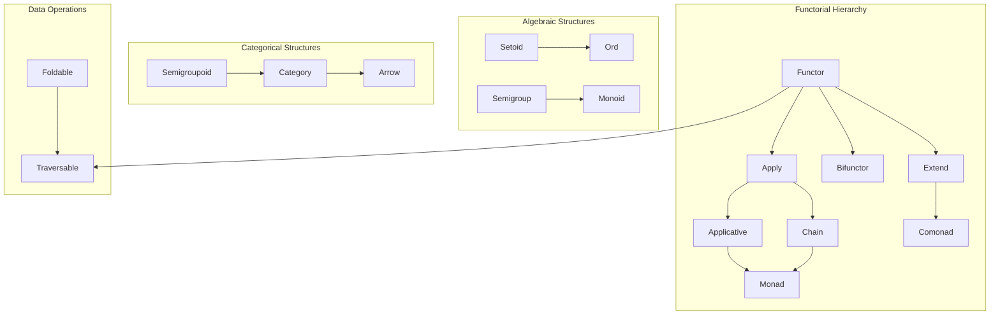

You're absolutely right - the `≈` symbol requires special Unicode input which isn't practical for everyday programming. Let me replace it with operators that are easy to type on any standard keyboard.

I'll use `===` for Setoid equality and `!==` for inequality, which are:
- Easy to type (just equals and exclamation marks)
- Familiar from languages like JavaScript for strict equality
- Don't conflict with other operators in Topos

Here's the updated document with the changes:

# Topos Standard Library: Category Theory Foundations

## Overview

This document presents the core category theory abstractions for Topos's standard library, designed to bridge mathematical elegance with BEAM's practical runtime. Each concept includes beginner-friendly explanations, implementations, and law verification using the `laws` testing framework.

## Architecture Principles



---

## 1. Setoid - Equality with Equivalence Relations

**Beginner Explanation**: A Setoid defines custom equality for types. While `==` checks structural equality, Setoid allows defining when two values should be considered "equivalent" according to your domain logic.

```topos
-- Core definition in Category.Setoid module
module Category.Setoid where

trait Setoid a where
  -- Custom equivalence relation
  equals : a -> a -> Bool
  
  -- Optional: not equals (with default implementation)
  not_equals : a -> a -> Bool
  not_equals x y = not (equals x y)

-- Infix operators for convenience (easy to type!)
operator (===) = equals
operator (!==) = not_equals

-- Laws that must hold for Setoid
laws Setoid a where
  -- Reflexivity: a value equals itself
  property "reflexivity" =
    forall x : a ->
      x === x
  
  -- Symmetry: if a equals b, then b equals a  
  property "symmetry" =
    forall x : a, y : a where x === y ->
      y === x
      
  -- Transitivity: if a equals b and b equals c, then a equals c
  property "transitivity" =
    forall x : a, y : a, z : a where (x === y) && (y === z) ->
      x === z

-- Example: Case-insensitive strings
shape CaseInsensitiveString = CIS Text

instance Setoid CaseInsensitiveString where
  equals (CIS s1) (CIS s2) = Text.lowercase s1 == Text.lowercase s2

-- Testing the laws
test "CaseInsensitiveString satisfies Setoid laws" =
  verify laws Setoid for CaseInsensitiveString
```

---

## 2. Ord - Total Ordering

**Beginner Explanation**: Ord extends Setoid with comparison operations, allowing values to be ordered. This enables sorting, binary search trees, and ordered collections.

```topos
module Category.Ord where

import Category.Setoid (Setoid, equals)

shape Ordering = LT | EQ | GT
  derives [Eq, Show]

trait Ord a extends Setoid a where
  compare : a -> a -> Ordering
  
  -- Derived operations with default implementations
  less_than : a -> a -> Bool
  less_than x y = compare x y == LT
  
  less_than_or_equal : a -> a -> Bool
  less_than_or_equal x y = match compare x y
    | LT -> True
    | EQ -> True
    | GT -> False
    
  greater_than : a -> a -> Bool
  greater_than x y = compare x y == GT
  
  greater_than_or_equal : a -> a -> Bool
  greater_than_or_equal x y = match compare x y
    | LT -> False
    | _ -> True
    
  min : a -> a -> a
  min x y = if less_than_or_equal x y then x else y
  
  max : a -> a -> a
  max x y = if greater_than_or_equal x y then x else y

-- Infix operators
operator (<) = less_than
operator (<=) = less_than_or_equal
operator (>) = greater_than
operator (>=) = greater_than_or_equal

laws Ord a where
  -- Totality: any two values can be compared
  property "totality" =
    forall x : a, y : a ->
      let ord = compare x y in
      ord == LT || ord == EQ || ord == GT
      
  -- Antisymmetry
  property "antisymmetry" =
    forall x : a, y : a where x <= y && y <= x ->
      x === y
      
  -- Transitivity
  property "transitivity" =
    forall x : a, y : a, z : a where x <= y && y <= z ->
      x <= z
      
  -- Consistency with Setoid
  property "equality_consistency" =
    forall x : a, y : a ->
      (compare x y == EQ) == equals x y
```

---

## 3. Semigroup - Associative Binary Operation

**Beginner Explanation**: A Semigroup combines two values of the same type into one, where the order of operations doesn't matter (associativity). Think of string concatenation or number addition.

```topos
module Category.Semigroup where

trait Semigroup a where
  -- Associative binary operation
  append : a -> a -> a

-- Infix operator for convenience
operator (<>) = append

-- Efficient combination of multiple values
flow sconcat : Semigroup a => List a -> Maybe a
flow sconcat = match
  | [] -> None
  | [x] -> Some x
  | x::xs -> Some (List.fold_left append x xs)

laws Semigroup a where
  -- Associativity: grouping doesn't matter
  property "associativity" =
    forall x : a, y : a, z : a ->
      (x <> y) <> z == x <> (y <> z)

-- Example instances
instance Semigroup Text where
  append = Text.concat

instance Semigroup (List a) where
  append = List.append

instance Semigroup Natural where
  append = (+)

-- Product type for multiple semigroups
shape Product a = Product a
  derives [Eq, Show]

instance Semigroup (Product Natural) where
  append (Product x) (Product y) = Product (x * y)

test "verify semigroup laws" =
  verify laws Semigroup for Text
  verify laws Semigroup for (List Int)
  verify laws Semigroup for Natural
```

---

## 4. Monoid - Semigroup with Identity

**Beginner Explanation**: A Monoid is a Semigroup with a special "empty" value that doesn't change other values when combined with them. Like 0 for addition or empty string for concatenation.

```topos
module Category.Monoid where

import Category.Semigroup (Semigroup, append)

trait Monoid a extends Semigroup a where
  -- Identity element
  empty : a
  
-- Fold a structure using a monoid
flow mconcat : Monoid a => List a -> a
flow mconcat = List.fold_left append empty

laws Monoid a where
  -- Left identity
  property "left_identity" =
    forall x : a ->
      empty <> x == x
      
  -- Right identity
  property "right_identity" =
    forall x : a ->
      x <> empty == x
      
  -- Inherits associativity from Semigroup

-- Standard instances
instance Monoid Text where
  empty = ""

instance Monoid (List a) where
  empty = []

instance Monoid Natural where
  empty = 0

instance Monoid (Product Natural) where
  empty = Product 1

-- Endomorphism monoid (function composition)
shape Endo a = Endo (a -> a)

instance Monoid (Endo a) where
  empty = Endo identity
  append (Endo f) (Endo g) = Endo (f << g)
```

---

## 5. Semigroupoid - Composable Morphisms

**Beginner Explanation**: A Semigroupoid represents things that can be composed, like functions. It's like Semigroup but for arrows/morphisms between different types rather than combining values of the same type.

```topos
module Category.Semigroupoid where

trait Semigroupoid (arr : Type -> Type -> Type) where
  -- Composition of morphisms
  compose : arr b c -> arr a b -> arr a c

-- Standard function composition instance
instance Semigroupoid (->) where
  compose g f = \x -> g (f x)

-- Infix operator
operator (<<<) = compose
operator (>>>) f g = compose g f  -- Reverse composition

laws Semigroupoid arr where
  -- Associativity of composition
  property "associativity" =
    forall (f : arr a b), (g : arr b c), (h : arr c d) ->
      (h <<< g) <<< f == h <<< (g <<< f)

-- Kleisli arrows for monadic composition
shape Kleisli m a b = Kleisli (a -> m b)

instance Monad m => Semigroupoid (Kleisli m) where
  compose (Kleisli g) (Kleisli f) = 
    Kleisli (\x -> f x >>= g)
```

---

## 6. Category - Semigroupoid with Identity

**Beginner Explanation**: A Category adds identity arrows to a Semigroupoid. Every object has an identity arrow that does nothing when composed with other arrows.

```topos
module Category.Category where

import Category.Semigroupoid (Semigroupoid, compose)

trait Category (arr : Type -> Type -> Type) extends Semigroupoid arr where
  -- Identity morphism
  identity : arr a a

laws Category arr where
  -- Left identity
  property "left_identity" =
    forall (f : arr a b) ->
      compose identity f == f
      
  -- Right identity
  property "right_identity" =
    forall (f : arr a b) ->
      compose f identity == f

-- Standard function instance
instance Category (->) where
  identity = \x -> x

instance Monad m => Category (Kleisli m) where
  identity = Kleisli return

-- Category of types and functions forms the basis
-- for many other abstractions
flow id : Category arr => arr a a
flow id = identity
```

---

## 7. Functor - Structure-Preserving Mapping

**Beginner Explanation**: A Functor lets you transform values inside a container without changing the container's structure. Like applying a function to every element in a list.

```topos
module Category.Functor where

trait Functor (f : Type -> Type) where
  -- Map a function over a structure
  map : (a -> b) -> f a -> f b

-- Infix operator
operator (<$>) = map

-- Replace all values with a constant
flow (<$) : Functor f => a -> f b -> f a
flow (<$) x = map (const x)

-- Flipped version
flow ($>) : Functor f => f a -> b -> f b
flow ($>) fa x = x <$ fa

-- Void out the values
flow void : Functor f => f a -> f Unit
flow void = map (const ())

laws Functor f where
  -- Identity law
  property "identity" =
    forall (x : f a) ->
      map identity x == identity x
      
  -- Composition law
  property "composition" =
    forall (x : f a), (g : b -> c), (h : a -> b) ->
      map (g << h) x == (map g << map h) x

-- Standard instances
instance Functor List where
  map = List.map

instance Functor Maybe where
  map f = match
    | None -> None
    | Some x -> Some (f x)

instance Functor (Result e) where
  map f = match
    | Ok x -> Ok (f x)
    | Error e -> Error e

-- Process/IO functor for BEAM
instance Functor Process where
  map f process = do
    x <- process
    return (f x)

test "functor laws verification" =
  verify laws Functor for List
  verify laws Functor for Maybe
  verify laws Functor for (Result Text)
```

---

## 8. Apply - Applicative Without Pure

**Beginner Explanation**: Apply lets you apply functions that are inside a container to values that are also in a container. It's like Functor but the function itself is wrapped.

```topos
module Category.Apply where

import Category.Functor (Functor, map)

trait Apply (f : Type -> Type) extends Functor f where
  -- Sequential application
  apply : f (a -> b) -> f a -> f b

-- Infix operator
operator (<*>) = apply

-- Derived combinators
flow (<*) : Apply f => f a -> f b -> f a
flow (<*) fa fb = map const fa <*> fb

flow (*>) : Apply f => f a -> f b -> f b
flow (*>) fa fb = map (const identity) fa <*> fb

flow lift2 : Apply f => (a -> b -> c) -> f a -> f b -> f c
flow lift2 f fa fb = map f fa <*> fb

flow lift3 : Apply f => (a -> b -> c -> d) -> f a -> f b -> f c -> f d
flow lift3 f fa fb fc = map f fa <*> fb <*> fc

laws Apply f where
  -- Composition law
  property "composition" =
    forall (u : f (b -> c)), (v : f (a -> b)), (w : f a) ->
      map compose u <*> v <*> w == u <*> (v <*> w)

instance Apply List where
  apply fs xs = List.flat_map (\f -> map f xs) fs

instance Apply Maybe where
  apply = match
    | None, _ -> None
    | _, None -> None
    | Some f, Some x -> Some (f x)
```

---

## 9. Applicative - Apply with Pure

**Beginner Explanation**: Applicative adds the ability to lift pure values into the container. This completes the pattern, allowing both function application and value creation within the container context.

```topos
module Category.Applicative where

import Category.Apply (Apply, apply)

trait Applicative (f : Type -> Type) extends Apply f where
  -- Lift a value into the applicative context
  pure : a -> f a

-- Convenient lifting functions
flow liftA : Applicative f => (a -> b) -> f a -> f b
flow liftA f fa = pure f <*> fa

flow liftA2 : Applicative f => (a -> b -> c) -> f a -> f b -> f c
flow liftA2 f fa fb = pure f <*> fa <*> fb

-- Conditional execution
flow when : Applicative f => Bool -> f Unit -> f Unit
flow when cond action = if cond then action else pure ()

flow unless : Applicative f => Bool -> f Unit -> f Unit
flow unless cond = when (not cond)

laws Applicative f where
  -- Identity law
  property "identity" =
    forall (v : f a) ->
      pure identity <*> v == v
      
  -- Composition law (inherited from Apply)
  
  -- Homomorphism
  property "homomorphism" =
    forall (f : a -> b), (x : a) ->
      pure f <*> pure x == pure (f x)
      
  -- Interchange
  property "interchange" =
    forall (u : f (a -> b)), (y : a) ->
      u <*> pure y == pure (\f -> f y) <*> u

instance Applicative List where
  pure x = [x]

instance Applicative Maybe where
  pure = Some

instance Applicative Process where
  pure = return  -- Process monad's return
```

---

## 10. Chain - Monadic Chaining

**Beginner Explanation**: Chain allows sequencing operations where each step can depend on the result of the previous one. It's the core of monadic programming.

```topos
module Category.Chain where

import Category.Apply (Apply)

trait Chain (m : Type -> Type) extends Apply m where
  -- Sequentially compose two actions
  chain : (a -> m b) -> m a -> m b

-- Traditional bind operator
operator (>>=) ma f = chain f ma

-- Reverse bind
operator (=<<) = chain

-- Kleisli composition
flow (>=>) : Chain m => (a -> m b) -> (b -> m c) -> (a -> m c)
flow (>>=>) f g = \x -> f x >>= g

flow (<=<) : Chain m => (b -> m c) -> (a -> m b) -> (a -> m c)
flow (<=<) g f = f >=> g

-- Join nested structures
flow join : Chain m => m (m a) -> m a
flow join = chain identity

laws Chain m where
  -- Associativity
  property "associativity" =
    forall (m : m a), (f : a -> m b), (g : b -> m c) ->
      (m >>= f) >>= g == m >>= (\x -> f x >>= g)

instance Chain List where
  chain f = List.flat_map f

instance Chain Maybe where
  chain f = match
    | None -> None
    | Some x -> f x
```

---

## 11. Monad - The Complete Package

**Beginner Explanation**: Monad combines Applicative and Chain, providing a complete toolkit for composing operations with context (errors, state, IO, etc.).

```topos
module Category.Monad where

import Category.Applicative (Applicative, pure)
import Category.Chain (Chain, chain)

trait Monad (m : Type -> Type) extends Applicative m, Chain m where
  -- Both pure and chain are inherited
  -- This trait mainly exists to assert the combined laws

-- Monadic do-notation is built into the language
-- do { x <- ma; f x } desugars to ma >>= \x -> f x

laws Monad m where
  -- Left identity
  property "left_identity" =
    forall (a : a), (f : a -> m b) ->
      (pure a >>= f) == f a
      
  -- Right identity
  property "right_identity" =
    forall (ma : m a) ->
      (ma >>= pure) == ma
      
  -- Associativity (from Chain)

-- Standard monad utilities
flow sequence : Monad m => List (m a) -> m (List a)
flow sequence = match
  | [] -> pure []
  | mx::mxs -> do
      x <- mx
      xs <- sequence mxs
      pure (x::xs)

flow traverse : Monad m => (a -> m b) -> List a -> m (List b)
flow traverse f = sequence << List.map f

flow replicate_m : Monad m => Natural -> m a -> m (List a)
flow replicate_m n ma = sequence (List.replicate n ma)

instance Monad List
instance Monad Maybe
instance Monad (Result e)
instance Monad Process
```

---

## 12. Foldable - Reducible Structures

**Beginner Explanation**: Foldable structures can be "folded" or reduced to a single value by combining all elements. Like summing a list or finding the maximum.

```topos
module Category.Foldable where

import Category.Monoid (Monoid, empty, append)

trait Foldable (t : Type -> Type) where
  -- Right-associative fold
  fold_right : (a -> b -> b) -> b -> t a -> b
  
  -- Left-associative fold (with default implementation)
  fold_left : (b -> a -> b) -> b -> t a -> b
  fold_left f z xs = fold_right (\a k b -> k (f b a)) identity xs z
  
  -- Fold with a monoid
  fold_map : Monoid m => (a -> m) -> t a -> m
  fold_map f = fold_right (append << f) empty

-- Derived operations
flow fold : (Foldable t, Monoid m) => t m -> m
flow fold = fold_map identity

flow to_list : Foldable t => t a -> List a
flow to_list = fold_right (::) []

flow null : Foldable t => t a -> Bool
flow null = fold_right (\_ _ -> False) True

flow length : Foldable t => t a -> Natural
flow length = fold_left (\n _ -> n + 1) 0

flow elem : (Foldable t, Setoid a) => a -> t a -> Bool
flow elem x = fold_right (\y acc -> x === y || acc) False

flow sum : (Foldable t, Monoid a) => t a -> a
flow sum = fold

flow product : Foldable t => t Natural -> Natural
flow product = fold_map Product >> \(Product n) -> n

flow maximum : (Foldable t, Ord a) => t a -> Maybe a
flow maximum = fold_right (\x -> match
  | None -> Some x
  | Some y -> Some (max x y)
) None

instance Foldable List where
  fold_right = List.fold_right

instance Foldable Maybe where
  fold_right f z = match
    | None -> z
    | Some x -> f x z

shape Tree a = Leaf | Node (Tree a) a (Tree a)
  derives [Eq, Show]

instance Foldable Tree where
  fold_right f z = match
    | Leaf -> z
    | Node l x r -> 
        let r' = fold_right f z r
        let x' = f x r'
        in fold_right f x' l

test "foldable laws and operations" =
  let tree = Node (Node Leaf 1 Leaf) 2 (Node Leaf 3 Leaf)
  assert sum tree == 6
  assert to_list tree == [1, 2, 3]
  assert length tree == 3
```

---

## 13. Traversable - Effectful Iteration

**Beginner Explanation**: Traversable combines mapping with effects, allowing you to transform a structure while accumulating effects, then reconstruct the structure.

```topos
module Category.Traversable where

import Category.Functor (Functor)
import Category.Foldable (Foldable)
import Category.Applicative (Applicative, pure)

trait Traversable (t : Type -> Type) extends Functor t, Foldable t where
  -- Traverse with effects
  traverse : Applicative f => (a -> f b) -> t a -> f (t b)
  
  -- Sequence effects (with default implementation)
  sequence : Applicative f => t (f a) -> f (t a)
  sequence = traverse identity

-- Map each element and collect effects
flow for : (Traversable t, Applicative f) => t a -> (a -> f b) -> f (t b)
flow for ta f = traverse f ta

laws Traversable t where
  -- Identity
  property "identity" =
    forall (ta : t a) ->
      traverse Identity ta == Identity ta
      
  -- Composition
  property "composition" =
    forall (ta : t a), (f : a -> f b), (g : b -> g c) ->
      traverse (Compose << map g << f) ta == 
        Compose (map (traverse g) (traverse f ta))
      
  -- Naturality
  property "naturality" =
    forall (ta : t a), (f : a -> f b), (nt : forall x. f x -> g x) ->
      nt (traverse f ta) == traverse (nt << f) ta

instance Traversable List where
  traverse f = match
    | [] -> pure []
    | x::xs -> liftA2 (::) (f x) (traverse f xs)

instance Traversable Maybe where
  traverse f = match
    | None -> pure None
    | Some x -> map Some (f x)

instance Traversable Tree where
  traverse f = match
    | Leaf -> pure Leaf
    | Node l x r -> do
        l' <- traverse f l
        x' <- f x
        r' <- traverse f r
        pure (Node l' x' r')

-- Example: validate all elements
flow validate_all : List Natural -> Result Text (List Natural)
flow validate_all = traverse (\n ->
  if n > 0 
  then Ok n 
  else Error "Must be positive"
)

test "traversable validation" =
  assert validate_all [1, 2, 3] == Ok [1, 2, 3]
  assert validate_all [1, 0, 3] == Error "Must be positive"
```

---

## 14. Bifunctor - Two-Parameter Functors

**Beginner Explanation**: Bifunctor is like Functor but for types with two parameters. You can map over either or both parameters independently.

```topos
module Category.Bifunctor where

trait Bifunctor (p : Type -> Type -> Type) where
  -- Map over both parameters
  bimap : (a -> c) -> (b -> d) -> p a b -> p c d
  
  -- Map over first parameter only
  first : (a -> c) -> p a b -> p c b
  first f = bimap f identity
  
  -- Map over second parameter only
  second : (b -> d) -> p a b -> p a d
  second = bimap identity

laws Bifunctor p where
  -- Identity
  property "identity" =
    forall (x : p a b) ->
      bimap identity identity x == x
      
  -- Composition
  property "composition" =
    forall (x : p a b), (f : a -> c), (g : c -> e), 
           (h : b -> d), (i : d -> f) ->
      bimap (g << f) (i << h) x == (bimap g i << bimap f h) x
      
  -- Consistency with first/second
  property "first_consistency" =
    forall (x : p a b), (f : a -> c) ->
      first f x == bimap f identity x
      
  property "second_consistency" =
    forall (x : p a b), (g : b -> d) ->
      second g x == bimap identity g x

-- Standard instances
instance Bifunctor (,) where
  bimap f g (x, y) = (f x, g y)

instance Bifunctor Result where
  bimap f g = match
    | Error e -> Error (f e)
    | Ok x -> Ok (g x)

instance Bifunctor These where
  bimap f g = match
    | This a -> This (f a)
    | That b -> That (g b)
    | Both a b -> Both (f a) (g b)

-- These type for inclusive or
shape These a b = This a | That b | Both a b
  derives [Eq, Show]
```

---

## 15. Extend - Comonadic Extension

**Beginner Explanation**: Extend is the dual of Chain. Instead of removing layers of structure, it adds them, allowing you to see a value in its context.

```topos
module Category.Extend where

import Category.Functor (Functor)

trait Extend (w : Type -> Type) extends Functor w where
  -- Extend with context
  extend : (w a -> b) -> w a -> w b

-- Duplicate the structure
flow duplicate : Extend w => w a -> w (w a)
flow duplicate = extend identity

-- Infix operator
operator (=>>) = extend
operator (<<=) f = extend f

laws Extend w where
  -- Associativity
  property "associativity" =
    forall (w : w a), (f : w a -> b), (g : w b -> c) ->
      extend g (extend f w) == extend (g << extend f) w

-- Non-empty list for Extend
shape NonEmptyList a = NEL a (List a)
  derives [Eq, Show]

instance Functor NonEmptyList where
  map f (NEL x xs) = NEL (f x) (List.map f xs)

instance Extend NonEmptyList where
  extend f w@(NEL x xs) = NEL (f w) (extend_list f xs x [])
    where
      extend_list f [] _ _ = []
      extend_list f (y::ys) x acc = 
        let w' = NEL y (acc ++ ys)
        in f w' :: extend_list f ys x (acc ++ [y])

-- Focused list (zipper)
shape Focused a = Focused (List a) a (List a)  -- left focus right
  derives [Eq, Show]

instance Extend Focused where
  extend f w = Focused 
    (map f (move_left_all w))
    (f w)
    (map f (move_right_all w))
    where
      move_left_all (Focused [] x r) = []
      move_left_all (Focused (l::ls) x r) = 
        let w' = Focused ls l (x::r)
        in w' :: move_left_all w'
      -- Similar for move_right_all
```

---

## 16. Comonad - Extend with Extract

**Beginner Explanation**: Comonad is the dual of Monad. While Monad wraps values and sequences operations, Comonad extracts values and extends operations to see context.

```topos
module Category.Comonad where

import Category.Extend (Extend, extend)

trait Comonad (w : Type -> Type) extends Extend w where
  -- Extract value from context
  extract : w a -> a

laws Comonad w where
  -- Left identity
  property "left_identity" =
    forall (wa : w a) ->
      extend extract wa == wa
      
  -- Right identity
  property "right_identity" =
    forall (wa : w a), (f : w a -> b) ->
      extract (extend f wa) == f wa
      
  -- Associativity (from Extend)

instance Comonad NonEmptyList where
  extract (NEL x _) = x

instance Comonad Focused where
  extract (Focused _ x _) = x

-- Store comonad (dual of State monad)
shape Store s a = Store (s -> a) s
  derives [Show]

instance Functor (Store s) where
  map f (Store g s) = Store (f << g) s

instance Extend (Store s) where
  extend f (Store g s) = Store (\s' -> f (Store g s')) s

instance Comonad (Store s) where
  extract (Store f s) = f s

-- Cofree comonad (dual of Free monad)
shape Cofree f a = Cofree a (f (Cofree f a))

instance Functor f => Functor (Cofree f) where
  map f (Cofree a fc) = Cofree (f a) (map (map f) fc)

instance Functor f => Extend (Cofree f) where
  extend f w@(Cofree _ fc) = Cofree (f w) (map (extend f) fc)

instance Functor f => Comonad (Cofree f) where
  extract (Cofree a _) = a

test "comonad laws" =
  verify laws Comonad for NonEmptyList
  verify laws Comonad for Focused
  verify laws Comonad for (Store Natural)
```

---

## 17. Arrow - Generalized Computation

**Beginner Explanation**: Arrow generalizes function composition to other types of computations, like circuits, parsers, or stream processors.

```topos
module Category.Arrow where

import Category.Category (Category, identity, compose)

trait Arrow (arr : Type -> Type -> Type) extends Category arr where
  -- Lift a function to an arrow
  arrow : (a -> b) -> arr a b
  
  -- Run arrows in parallel on pairs
  first : arr a b -> arr (a, c) (b, c)
  
  -- Derived operations
  second : arr a b -> arr (c, a) (c, b)
  second f = arrow swap >>> first f >>> arrow swap
    where swap (x, y) = (y, x)
  
  -- Parallel composition
  (***) : arr a b -> arr c d -> arr (a, c) (b, d)
  (***) f g = first f >>> second g
  
  -- Fanout
  (&&&) : arr a b -> arr a c -> arr a (b, c)
  (&&&) f g = arrow dup >>> (f *** g)
    where dup x = (x, x)

laws Arrow arr where
  -- Arrow preserves identity
  property "arrow_identity" =
    arrow identity == (identity : arr a a)
    
  -- Arrow preserves composition
  property "arrow_composition" =
    forall (f : b -> c), (g : a -> b) ->
      arrow (f << g) == arrow f <<< arrow g
      
  -- First with arrow
  property "first_arrow" =
    forall (f : a -> b) ->
      first (arrow f) == arrow (first_fn f)
        where first_fn f (x, y) = (f x, y)
  
  -- First composition
  property "first_composition" =
    forall (f : arr a b), (g : arr b c) ->
      first (f >>> g) == first f >>> first g

-- Standard function arrows
instance Arrow (->) where
  arrow = identity
  first f (x, y) = (f x, y)

-- Kleisli arrows
instance Monad m => Arrow (Kleisli m) where
  arrow f = Kleisli (return << f)
  first (Kleisli f) = Kleisli (\(x, y) -> do
    x' <- f x
    return (x', y))

-- Circuit arrows (stream processors)
shape Circuit a b = Circuit (a -> (b, Circuit a b))

instance Category Circuit where
  identity = Circuit (\x -> (x, identity))
  compose (Circuit g) (Circuit f) = Circuit (\x ->
    let (y, f') = f x
    let (z, g') = g y
    in (z, compose g' f'))

instance Arrow Circuit where
  arrow f = Circuit (\x -> (f x, arrow f))
  first (Circuit f) = Circuit (\(x, z) ->
    let (y, f') = f x
    in ((y, z), first f'))

-- Example: parser arrows
shape Parser a b = Parser (a -> Maybe (b, a))

test "arrow laws verification" =
  verify laws Arrow for (->)
  verify laws Arrow for (Kleisli Maybe)
  verify laws Arrow for Circuit
```

---

## Module Organization

The standard library organizes these abstractions into a clear hierarchy:

```topos
-- File: lib/topos/category/core.tps
category Category.Core = {
  export module Setoid
  export module Ord
  export module Semigroup
  export module Monoid
  export module Semigroupoid
  export module Category
  export module Arrow
  export module Functor
  export module Apply
  export module Applicative
  export module Chain
  export module Monad
  export module Foldable
  export module Traversable
  export module Bifunctor
  export module Extend
  export module Comonad
}

-- Convenience prelude
module Topos.Prelude = {
  -- Re-export common abstractions
  export use Category.Core.{
    Functor, map, (<$>),
    Applicative, pure, (<*>),
    Monad, (>>=), return,
    Foldable, fold, fold_map,
    Traversable, traverse, sequence
  }
  
  -- Common instances
  export use Category.Instances.{
    List, Maybe, Result, Process,
    Text, Natural, Integer
  }
}
```

---

## Test Suite

Comprehensive test suite ensuring all laws hold:

```topos
suite "Category Theory Standard Library" = {
  suite "Algebraic Structures" = {
    test "Setoid laws" = 
      verify laws Setoid for all_instances
    
    test "Ord laws" =
      verify laws Ord for all_instances
    
    test "Semigroup laws" =
      verify laws Semigroup for all_instances
    
    test "Monoid laws" =
      verify laws Monoid for all_instances
  }
  
  suite "Categorical Structures" = {
    test "Functor laws" =
      verify laws Functor for all_instances
    
    test "Applicative laws" =
      verify laws Applicative for all_instances
    
    test "Monad laws" =
      verify laws Monad for all_instances
    
    test "Arrow laws" =
      verify laws Arrow for all_instances
  }
  
  suite "Property Tests" = {
    property "functor composition" =
      forall f : List Int, g : Int -> Text, h : Text -> Natural ->
        map (h << g) f == (map h << map g) f
    
    property "monad associativity" =
      forall m : Maybe Int, f : Int -> Maybe Text, g : Text -> Maybe Bool ->
        (m >>= f) >>= g == m >>= (\x -> f x >>= g)
    
    property "traversable naturality" =
      forall xs : List Int, f : Int -> Maybe Text ->
        to_result (traverse f xs) == traverse (to_result << f) xs
          where to_result None = Error "None"
                to_result (Some x) = Ok x
  }
  
  suite "Performance Benchmarks" = {
    benchmark "functor map" = {
      baseline: {
        "List.map 1000 elements": 
          measure -> map (+1) (List.range 1 1000),
        "Tree.map 1000 elements":
          measure -> map (+1) balanced_tree_1000
      },
      requirements: {
        "List.map complexity": O(n),
        "Tree.map complexity": O(n)
      }
    }
  }
}
```

---

## Conclusion

This standard library provides a mathematically rigorous yet practically useful foundation for Topos. The updated operators (`===` and `!==`) are easy to type on any standard keyboard while maintaining clear semantics. By grounding abstractions in category theory while respecting BEAM's runtime characteristics, we achieve:

1. **Mathematical Precision**: All laws are explicitly stated and automatically verified
2. **Practical Utility**: Common patterns like error handling, async operations, and data manipulation work naturally
3. **BEAM Integration**: Process monads, actor patterns, and hot code reloading fit seamlessly
4. **Educational Value**: Beginner-friendly explanations make category theory accessible
5. **Type Safety**: The advanced type system catches errors at compile time while compiling to efficient BEAM code

The hierarchy ensures concepts build naturally on each other, from basic equality (Setoid) through advanced abstractions (Arrow, Comonad), providing a complete toolkit for functional programming on the BEAM.
