# Topos Language Guide

## Introduction

Topos is a new functional programming language for the BEAM virtual machine that fundamentally grounds itself in category theory principles. Unlike traditional functional languages that add categorical concepts as libraries, Topos makes category theory the foundation from which all language features emerge naturally. This creates a unique synthesis where mathematical rigor meets practical distributed systems programming.

## Core Philosophy

In Topos, **everything is a category**. Programs are compositions of morphisms (which we call "flows"), data flows through immutable transformations, and side effects are handled through algebraic effect handlers. The language treats the BEAM's actor model as a natural categorical structure, making distributed programming both type-safe and mathematically sound.

## Fundamental Concepts and Keywords

### 1. Shapes (Objects in Category Theory)

Shapes define data types as objects in a category. They are immutable by construction and support algebraic data types.

```topos
-- Product types (records)
shape User = {
  name: Text,
  age: Natural,
  email: Email
} deriving [Eq, Show, Doc]

-- Sum types (variants)
shape Result a b = Ok a | Error b

-- Recursive types
shape List a = Nil | Cons a (List a)
```

### 2. Flows (Morphisms)

Flows are pure functions that represent morphisms between objects. They compose naturally and preserve categorical properties.

> **Note**: Updated to include type class constraints using `=>` syntax for trait-bounded polymorphism.

```topos
-- Basic flow definition
flow greet : User -> Text
flow greet user = "Hello, " <> user.name

-- Composition using pipe operator
flow processUser : User -> Result User ValidationError
flow processUser =
  validate |> normalize |> store

-- Type class constraints
flow map : Functor f => (a -> b) -> f a -> f b
flow map f = fmap f

-- Multiple constraints
flow liftM2 : (Monad m, Applicative f) => (a -> b -> c) -> m a -> m b -> m c
```

### 3. Trait System (Type Classes)

> **Note**: This section replaces the previous "Categories and Modules" section. The trait system provides a general mechanism for type classes, replacing ad-hoc polymorphism with principled abstractions. Categories are still used for module organization (see Module System section below).

Traits define type classes with laws that implementations must satisfy. This is the foundation for all category theory abstractions in Topos.

```topos
-- Define a trait
trait Setoid a where
  -- Type class methods
  equals : a -> a -> Bool

  -- Default implementations
  not_equals : a -> a -> Bool
  not_equals x y = not (equals x y)

-- Define operators for traits
operator (===) = equals
operator (!==) = not_equals

-- Trait hierarchies with extends
trait Ord a extends Setoid a where
  compare : a -> a -> Ordering

  -- Derived operations
  less_than : a -> a -> Bool
  less_than x y = compare x y == LT

-- Higher-kinded traits with kind annotations
trait Functor (f : Type -> Type) where
  fmap : (a -> b) -> f a -> f b

-- Trait laws (verified by property testing)
laws Functor f where
  property "identity" =
    forall x : f a ->
      fmap identity x === x

  property "composition" =
    forall x : f a, g : (a -> b), h : (b -> c) ->
      fmap (h . g) x === (fmap h . fmap g) x
```

#### Common Trait Operators

The trait system includes standard operators for common abstractions:

| Trait | Description | Keyword | Operator |
|-------|-------------|---------|----------|
| Setoid | Type class equality | `equals` | `===` |
| Setoid | Type class inequality | `not_equals` | `!==` |
| Ord | Less than | `less_than` | `<` |
| Ord | Less than or equal | `less_than_or_equal` | `<=` |
| Ord | Greater than | `greater_than` | `>` |
| Ord | Greater than or equal | `greater_than_or_equal` | `>=` |
| Semigroup | Associative append | `append` | `<>` |
| Functor | Map over structure | `map` or `fmap` | `<$>` |

### 4. Instances (Trait Implementations)

Instances provide concrete implementations of traits for specific types.

```topos
-- Simple instance
instance Setoid Natural where
  equals = (==)

-- Instance with constraints
instance Setoid a => Setoid (List a) where
  equals Nil Nil = True
  equals (Cons x xs) (Cons y ys) = x === y && xs === ys
  equals _ _ = False

-- Higher-kinded instance
instance Functor List where
  fmap f Nil = Nil
  fmap f (Cons x xs) = Cons (f x) (fmap f xs)

-- Instance for Maybe
instance Functor Maybe where
  fmap f None = None
  fmap f (Some x) = Some (f x)
```

### 5. Operators

> **Note**: New section. Topos supports custom operator definitions with precedence and associativity control.

```topos
-- Define custom operators
operator (<>) = append [infixl 6]
operator (<$>) = fmap [infixl 4]
operator (<*>) = apply [infixl 4]
operator (>>=) = bind [infixl 1]

-- Postfix operators
operator (!) = factorial [postfix]

-- Prefix operators
operator (-) = negate [prefix]

-- Standard operators by category:

-- Equality (Setoid)
operator (===) = equals
operator (!==) = not_equals

-- Functor/Applicative/Monad
operator (<$>) = fmap           -- Functor map
operator (<*>) = apply          -- Applicative apply
operator (>>=) = bind           -- Monadic bind
operator (>>)  = then_          -- Monadic sequence
operator (=<<) = bind_flipped   -- Flipped bind

-- Composition
operator (>=>) = kleisli_compose        -- Kleisli (left-to-right)
operator (<=<) = kleisli_compose_right  -- Kleisli (right-to-left)
operator (>>>) = compose_forward        -- Category (left-to-right)
operator (<<<) = compose_backward       -- Category (right-to-left)

-- Arrow
operator (***) = parallel  -- Parallel composition on pairs
operator (&&&) = fanout    -- Fanout (duplicate input)

-- Comonad
operator (=>>) = extend_forward   -- Extend (left-to-right)
operator (<<=) = extend_backward  -- Extend (right-to-left)
```

#### Operator Summary Tables

**Equality & Ordering (Setoid, Ord)**

| Description | Keyword | Operator |
|-------------|---------|----------|
| Type class equality | `equals` | `===` |
| Type class inequality | `not_equals` | `!==` |
| Less than | `less_than` | `<` |
| Less than or equal | `less_than_or_equal` | `<=` |
| Greater than | `greater_than` | `>` |
| Greater than or equal | `greater_than_or_equal` | `>=` |

**Algebraic Structures (Semigroup, Monoid)**

| Description | Keyword | Operator |
|-------------|---------|----------|
| Associative append | `append` | `<>` |

**Functor, Applicative, Monad**

| Description | Keyword | Operator |
|-------------|---------|----------|
| Functor map | `map` or `fmap` | `<$>` |
| Applicative apply | `apply` | `<*>` |
| Monadic bind | `bind` | `>>=` |
| Monadic sequence (ignore left) | `then_` | `>>` |
| Flipped bind | `bind` (flipped args) | `=<<` |

**Composition Operators**

| Description | Keyword | Operator |
|-------------|---------|----------|
| Kleisli composition (left-to-right) | N/A | `>=>` |
| Kleisli composition (right-to-left) | N/A | `<=<` |
| Category composition (left-to-right) | `compose` (flipped) | `>>>` |
| Category composition (right-to-left) | `compose` | `<<<` |

**Arrow Operators**

| Description | Keyword | Operator |
|-------------|---------|----------|
| Parallel composition on pairs | `parallel` | `***` |
| Fanout (duplicate input) | `fanout` | `&&&` |

**Comonad Operators**

| Description | Keyword | Operator |
|-------------|---------|----------|
| Extend (left-to-right) | `extend` (flipped) | `=>>` |
| Extend (right-to-left) | `extend` | `<<=` |

### 6. Built-in Functions

> **Note**: New section. Core functions that are fundamental to category theory and functional programming.

```topos
-- Identity morphism (required for all categories)
flow identity : a -> a
flow identity x = x

-- Constant function
flow const : a -> b -> a
flow const x _ = x

-- Function composition
flow compose : (b -> c) -> (a -> b) -> (a -> c)
flow compose g f = \x -> g (f x)

-- Flip argument order
flow flip : (a -> b -> c) -> (b -> a -> c)
flow flip f = \y x -> f x y

-- Monadic return (pure)
flow return : Monad m => a -> m a
flow pure : Applicative f => a -> f a
```

### 7. Categories and Modules

Modules organize code into categories with explicit structure. Modules can also group trait definitions and instances.

> **Note**: Updated to integrate with the trait system.

```topos
-- Module with types and functions
category Collections = {
  -- Objects (types)
  export shape List a
  export shape Set a

  -- Morphisms (flows)
  export flow map : (a -> b) -> List a -> List b
  export flow filter : (a -> b) -> List a -> List a
}

-- Module for trait definitions
module Category.Functor where
  export trait Functor (f : Type -> Type)
  export flow fmap : Functor f => (a -> b) -> f a -> f b

-- Module for instances
module Data.List.Instances where
  import Category.Functor (Functor)
  import Data.List (List)

  instance Functor List where
    fmap f Nil = Nil
    fmap f (Cons x xs) = Cons (f x) (fmap f xs)
```

### 8. Effects and Handlers

Side effects are managed through algebraic effect handlers, making them explicit in types.

```topos
-- Define an effect
effect FileIO = {
  read : Path -> String,
  write : Path -> String -> Unit
}

-- Use effects with perform keyword
flow loadConfig : Path -> Config / {FileIO}
flow loadConfig path = do
  content <- perform FileIO.read(path)
  return parseConfig(content)

-- Handle effects
handle loadConfig("app.toml") with
  FileIO.read(p) -> readFromDisk(p)
  FileIO.write(p, c) -> writeToDisk(p, c)
end

-- Trait-based effects
trait MonadIO (m : Type -> Type) where
  liftIO : IO a -> m a
```

### 9. Actors and Processes

BEAM processes are first-class with categorical structure.

```topos
actor Counter = {
  shape State = { count: Natural }
  shape Message = Increment | Decrement | Get

  flow init : Unit -> State
  flow init () = { count: 0 }

  flow handle : Message -> State -> (State, Maybe Reply)
  flow handle msg state = match msg
    | Increment -> ({ count: state.count + 1 }, None)
    | Decrement -> ({ count: state.count - 1 }, None)
    | Get -> (state, Some state.count)
  end
}
```

### 10. Pattern Matching

Advanced pattern matching with categorical foundations.

```topos
flow process : Message -> Response
flow process = match
  -- View patterns
  | parse_json -> Ok(data) -> handle_data(data)

  -- Or-patterns
  | Error(e) | Failure(e) -> handle_error(e)

  -- Pattern guards with bindings
  | Request(data) when validate(data) -> Valid(v) ->
    process_valid(v)

  -- Pattern synonyms
  | Success(result) -> return_success(result)
end
```

### 11. Documentation as First-Class

Documentation is mandatory and introspectable.

> **Note**: Extended to include documentation of trait laws.

```topos
doc "Calculates the distance between two points"
doc params {
  p1: "First point in 2D space",
  p2: "Second point in 2D space"
}
doc returns "Euclidean distance as Float"
doc examples """
  distance({x: 0, y: 0}, {x: 3, y: 4}) == 5.0
"""
flow distance : Point -> Point -> Float
flow distance p1 p2 =
  sqrt((p2.x - p1.x)^2 + (p2.y - p1.y)^2)

-- Documentation for trait instances
doc """
  Functor instance for List satisfies:
  - Identity: fmap identity == identity
  - Composition: fmap (h . g) == fmap h . fmap g
"""
instance Functor List where
  fmap = List.map
```

### 12. Testing as Language Primitive

> **Note**: Significantly expanded to include laws, property testing, verification, test suites, and benchmarking.

Tests are built into the language, not annotations. Topos provides multiple levels of testing from unit tests to property-based testing to automated law verification.

```topos
-- Unit tests
test "distance calculation" =
  let origin = {x: 0, y: 0}
  let point = {x: 3, y: 4}
  assert distance(origin, point) == 5.0

-- Property-based testing
property "distance is symmetric" =
  forall p1 p2 : Point ->
    distance(p1, p2) === distance(p2, p1)

-- Conditional properties with where clause
property "positive numbers have positive squares" =
  forall x : Natural where x > 0 ->
    x * x > 0

-- Law verification for traits
test "List satisfies Functor laws" =
  verify laws Functor for List

test "Maybe is a valid Monad" =
  verify laws Monad for Maybe

-- Test suites for organization
suite "Collection Operations" where
  test "map preserves length" =
    forall xs : List Natural ->
      List.length (List.map (+1) xs) == List.length xs

  test "filter reduces or maintains length" =
    forall xs : List Natural, p : (Natural -> Bool) ->
      List.length (List.filter p xs) <= List.length xs

  property "reverse is involutive" =
    forall xs : List a ->
      List.reverse (List.reverse xs) === xs

-- Benchmarks for performance testing
benchmark "fold performance" = {
  baseline: {
    "left fold": measure -> List.fold_left (+) 0 largeList,
    "right fold": measure -> List.fold_right (+) 0 largeList
  },

  requirements: {
    "fold under 100ms": time < 100.ms,
    "memory under 10MB": heap_growth < 10.mb
  }
}

benchmark "map vs manual recursion" = {
  baseline: {
    "using map": measure -> List.map (*2) numbers,
    "manual recursion": measure -> double_recursive numbers
  }
}
```

### 13. Type System Features

Advanced types with categorical grounding.

> **Note**: Extended with higher-kinded types, kind annotations, and multiple type class constraints.

```topos
-- Row polymorphism
flow getX : {x: Float | ρ} -> Float
flow getX record = record.x

-- Type families
type family Append xs ys where
  Append [] ys = ys
  Append (x:xs) ys = x : Append xs ys

-- Existential types
shape AbstractSet a = exists r. {
  rep: r,
  empty: r,
  insert: a -> r -> r,
  member: a -> r -> Bool
}

-- Higher-kinded types with kind annotations
trait Functor (f : Type -> Type) where
  fmap : (a -> b) -> f a -> f b

trait Bifunctor (p : Type -> Type -> Type) where
  bimap : (a -> c) -> (b -> d) -> p a b -> p c d

-- Multiple type class constraints
flow traverse : (Traversable t, Applicative f) => (a -> f b) -> t a -> f (t b)

-- Constraint syntax in forall (for properties/laws)
laws Setoid a where
  property "symmetry" =
    forall x : a, y : a where x === y ->
      y === x
```

### 14. Immutability and Updates

All data is immutable with structured update syntax.

```topos
-- Update with 'with' keyword
flow birthday : User -> User
flow birthday user =
  user with { age = user.age + 1 }

-- Optics for nested updates
flow updateCity : Text -> Person -> Person
flow updateCity newCity =
  Person.address.city.set newCity
```

## Complete Syntax Examples

### Functors and Natural Transformations

> **Note**: Updated to use trait system instead of ad-hoc functor keyword.

```topos
-- Define Functor trait
trait Functor (f : Type -> Type) where
  fmap : (a -> b) -> f a -> f b

-- Operator for fmap
operator (<$>) = fmap [infixl 4]

-- Functor laws
laws Functor f where
  property "identity" =
    forall x : f a ->
      fmap identity x === x

  property "composition" =
    forall x : f a, g : (a -> b), h : (b -> c) ->
      fmap (h . g) x === (fmap h . fmap g) x

-- List instance
instance Functor List where
  fmap f Nil = Nil
  fmap f (Cons x xs) = Cons (f x) (fmap f xs)

-- Maybe instance
instance Functor Maybe where
  fmap f None = None
  fmap f (Some x) = Some (f x)

-- Natural transformation
natural ListToMaybe : List ~> Maybe where
  transform : forall a. List a -> Maybe a
  transform Nil = None
  transform (Cons x _) = Some x

  -- Naturality law
  law naturality:
    forall f : (a -> b), xs : List a ->
      transform (fmap f xs) === fmap f (transform xs)

-- Functor composition
shape Compose f g a = Compose (f (g a))

instance (Functor f, Functor g) => Functor (Compose f g) where
  fmap h (Compose fga) = Compose (fmap (fmap h) fga)
```

#### Functor Operators

| Description | Keyword | Operator |
|-------------|---------|----------|
| Map function over structure | `fmap` or `map` | `<$>` |
| Replace with constant (left) | N/A | `<$` |
| Replace with constant (right) | N/A | `$>` |

### Applicative and Monad

> **Note**: New section showing the trait hierarchy for Applicative and Monad.

```topos
-- Applicative extends Functor
trait Applicative (f : Type -> Type) extends Functor f where
  pure : a -> f a
  apply : f (a -> b) -> f a -> f b

-- Operators
operator (<*>) = apply [infixl 4]

-- Applicative laws
laws Applicative f where
  property "identity" =
    forall v : f a ->
      pure identity <*> v === v

  property "composition" =
    forall u : f (b -> c), v : f (a -> b), w : f a ->
      pure compose <*> u <*> v <*> w === u <*> (v <*> w)

  property "homomorphism" =
    forall f : (a -> b), x : a ->
      pure f <*> pure x === pure (f x)

  property "interchange" =
    forall u : f (a -> b), y : a ->
      u <*> pure y === pure (\f -> f y) <*> u

-- Monad extends Applicative
trait Monad (m : Type -> Type) extends Applicative m where
  bind : m a -> (a -> m b) -> m b

-- Operators
operator (>>=) = bind [infixl 1]
operator (>>) = then_ [infixl 1]
operator (=<<) = flip bind [infixr 1]

-- Kleisli composition
flow (>=>) : Monad m => (a -> m b) -> (b -> m c) -> (a -> m c)
flow (>=>) f g = \x -> f x >>= g

operator (>=>) = kleisli_compose [infixr 1]
operator (<=<) = flip (>=>) [infixr 1]

-- Monad laws
laws Monad m where
  property "left identity" =
    forall a : a, k : (a -> m b) ->
      return a >>= k === k a

  property "right identity" =
    forall m : m a ->
      m >>= return === m

  property "associativity" =
    forall m : m a, k : (a -> m b), h : (b -> m c) ->
      (m >>= k) >>= h === m >>= (\x -> k x >>= h)

-- Maybe Monad instance
instance Monad Maybe where
  bind None _ = None
  bind (Some x) f = f x
```

#### Applicative and Monad Operators

| Trait | Description | Keyword | Operator |
|-------|-------------|---------|----------|
| Functor | Map over structure | `fmap` or `map` | `<$>` |
| Applicative | Lift pure value | `pure` | N/A |
| Applicative | Apply wrapped function | `apply` | `<*>` |
| Monad | Monadic bind | `bind` | `>>=` |
| Monad | Monadic sequence (ignore left) | `then_` | `>>` |
| Monad | Flipped bind | `bind` (flipped) | `=<<` |
| Monad | Kleisli composition (L→R) | N/A | `>=>` |
| Monad | Kleisli composition (R→L) | N/A | `<=<` |

### Session Types for Protocol Safety

```topos
-- Define a session protocol
session TwoPhaseCommit =
  !prepare -> ?vote ->
  choice {
    commit -> !finalize -> end,
    abort -> !rollback -> end
  }

-- Implement session
flow coordinator : Session[TwoPhaseCommit] -> Result
flow coordinator session = do
  send session Prepare
  vote <- receive session
  match vote
    | Ready ->
      select session commit
      send session Finalize
      Ok
    | NotReady ->
      select session abort
      send session Rollback
      Aborted
  end
```

### DSL Creation

```topos
-- Define a DSL
dsl MatrixDSL : Category where
  -- Grammar
  grammar Matrix where
    syntax "[[ _ ]]" : Matrix where
      [[ a, b; c, d ]] = Matrix 2 2 [[a,b], [c,d]]

  -- Operations
  operator (×) = matrix_multiply
  operator (ᵀ) = transpose [postfix]

  -- Laws
  law transpose_multiply:
    (A × B)ᵀ == Bᵀ × Aᵀ
```

## Memory Diagram

```mermaid
graph TB
    subgraph "Category Theory Foundation"
        CT[Category Type System]
        CT --> Objects[Objects/Shapes]
        CT --> Morphisms[Morphisms/Flows]
        CT --> Traits[Traits/Type Classes]
        CT --> Functors[Functors]
        CT --> NT[Natural Transformations]
    end

    subgraph "BEAM Runtime"
        VM[BEAM VM]
        VM --> Processes[Lightweight Processes]
        VM --> Messages[Message Passing]
        VM --> Supervision[Supervision Trees]
        VM --> HotReload[Hot Code Reloading]
    end

    subgraph "Type System"
        TS[Advanced Types]
        TS --> Row[Row Polymorphism]
        TS --> PV[Polymorphic Variants]
        TS --> TF[Type Families]
        TS --> ET[Existential Types]
        TS --> HKT[Higher-Kinded Types]
    end

    subgraph "Effects"
        EFF[Algebraic Effects]
        EFF --> Handlers[Effect Handlers]
        EFF --> Pure[Pure Core]
        EFF --> IO[I/O Effects]
        EFF --> Conc[Concurrency Effects]
    end

    subgraph "Testing"
        TEST[Testing Framework]
        TEST --> Units[Unit Tests]
        TEST --> Props[Property Tests]
        TEST --> Laws[Law Verification]
        TEST --> Bench[Benchmarks]
    end

    Objects --> Processes
    Morphisms --> Messages
    Functors --> Supervision
    NT --> HotReload
    Traits --> CT

    TS --> CT
    EFF --> VM
    TEST --> Traits
```



## Complete Case Study: Online Store

Let's build a modular online store system demonstrating all of Topos's features.

### Module 1: Core Domain Models

```topos
module Store.Domain where

-- Core shapes with documentation
doc "Represents a product in the catalog"
shape Product = {
  id: ProductId,
  name: Text,
  price: Money,
  stock: Natural
} deriving [Eq, Show, Doc]

doc "Customer information"
shape Customer = {
  id: CustomerId,
  name: Text,
  email: Email,
  address: Address
}

doc "Shopping cart with items"
shape Cart = {
  customer: CustomerId,
  items: List CartItem,
  created: Timestamp
}

shape CartItem = {
  product: ProductId,
  quantity: Natural
}

shape Order = {
  id: OrderId,
  customer: Customer,
  items: List OrderItem,
  total: Money,
  status: OrderStatus
}

shape OrderStatus =
  | Pending
  | Confirmed
  | Shipped TrackingNumber
  | Delivered
  | Cancelled Reason

-- Type families for calculations
type family TotalPrice items where
  TotalPrice [] = Money 0
  TotalPrice (item:rest) =
    item.price * item.quantity + TotalPrice rest
```

### Module 2: Effects Definition

```topos
module Store.Effects where

-- Database effect
effect Database = {
  query : Query a -> List a,
  insert : a -> Unit,
  update : Id -> a -> Unit,
  delete : Id -> Unit
}

-- Payment processing effect
effect Payment = {
  charge : Card -> Money -> PaymentResult,
  refund : TransactionId -> Money -> RefundResult
}

-- Email notification effect
effect Email = {
  send : Address -> Template -> Unit
}

-- Inventory management effect
effect Inventory = {
  check : ProductId -> Natural,
  reserve : ProductId -> Natural -> Bool,
  release : ProductId -> Natural -> Unit
}
```

### Module 3: Business Logic (Pure)

```topos
module Store.Logic where
import Store.Domain
import Store.Effects

-- Pure validation functions
doc "Validates a cart has items and all are in stock"
flow validateCart : Cart -> Result Cart ValidationError
flow validateCart cart = do
  ensure (not List.empty cart.items)
    "Cart cannot be empty"

  ensure (all validQuantity cart.items)
    "Invalid item quantities"

  Ok cart
where
  validQuantity item = item.quantity > 0

-- Price calculation with row polymorphism
flow calculateTotal : {items: List OrderItem | ρ} -> Money
flow calculateTotal order =
  List.foldl (\acc item ->
    acc + (item.price * item.quantity)
  ) (Money 0) order.items

-- Order state machine with pattern matching
flow processOrderStatus : OrderStatus -> OrderEvent -> OrderStatus
flow processOrderStatus = match
  | Pending, Confirm -> Confirmed
  | Confirmed, Ship(tracking) -> Shipped(tracking)
  | Shipped(_), Deliver -> Delivered
  | status, Cancel(reason) when cancelable(status) ->
    Cancelled(reason)
  | status, _ -> status  -- Invalid transitions ignored
end
where
  cancelable = match
    | Pending | Confirmed -> true
    | _ -> false
  end
```

### Module 4: Service Layer with Effects

```topos
module Store.Service where
import Store.Domain
import Store.Logic
import Store.Effects

-- Checkout service with multiple effects
flow checkout : Cart -> Result Order CheckoutError
  / {Database, Payment, Email, Inventory}
flow checkout cart = do
  -- Validate cart
  validCart <- validateCart cart |> liftResult

  -- Check inventory
  available <- all checkStock validCart.items
  ensure available StockUnavailable

  -- Reserve items
  reserved <- all reserveItem validCart.items
  ensure reserved ReservationFailed

  -- Create order
  let order = createOrder validCart
  perform Database.insert(order)

  -- Process payment
  payment <- perform Payment.charge(
    validCart.customer.card,
    order.total
  )

  match payment
    | Success(txn) -> do
      let confirmed = order with {
        status = Confirmed,
        transaction = txn
      }
      perform Database.update(order.id, confirmed)
      perform Email.send(
        order.customer.email,
        OrderConfirmation(confirmed)
      )
      Ok confirmed

    | Failure(reason) -> do
      -- Release reserved inventory
      each (releaseItem) validCart.items
      perform Database.update(order.id,
        order with { status = Cancelled(reason) })
      Error PaymentFailed(reason)
  end
where
  checkStock item =
    perform Inventory.check(item.product) >= item.quantity

  reserveItem item =
    perform Inventory.reserve(item.product, item.quantity)

  releaseItem item =
    perform Inventory.release(item.product, item.quantity)
```

### Module 5: Actor-Based Order Processing

```topos
module Store.OrderProcessor where
import Store.Domain
import Store.Service

-- Order processing actor with supervision
actor OrderProcessor = {
  shape State = {
    orders: Map OrderId Order,
    metrics: ProcessingMetrics
  }

  shape Message =
    | ProcessOrder Cart
    | UpdateStatus OrderId OrderStatus
    | GetOrder OrderId
    | GetMetrics

  flow init : Unit -> State
  flow init () = {
    orders: Map.empty,
    metrics: defaultMetrics
  }

  flow handle : Message -> State -> (State, Maybe Reply)
    / {Database, Payment, Email, Inventory}
  flow handle msg state = match msg
    | ProcessOrder cart -> do
      result <- checkout cart
      match result
        | Ok order ->
          let newState = state with {
            orders = Map.insert order.id order state.orders,
            metrics = updateMetrics Success state.metrics
          }
          (newState, Some order.id)

        | Error e ->
          let newState = state with {
            metrics = updateMetrics (Failure e) state.metrics
          }
          (newState, Some (Error e))
      end

    | UpdateStatus id status ->
      let updated = Map.update id
        (\order -> order with { status = status })
        state.orders
      (state with { orders = updated }, None)

    | GetOrder id ->
      (state, Map.lookup id state.orders)

    | GetMetrics ->
      (state, Some state.metrics)
  end
}

-- Supervisor for order processing
supervisor OrderSupervisor = {
  strategy: one_for_one,
  intensity: 10,
  period: 60,

  children: [
    {
      id: order_processor,
      start: OrderProcessor.start_link,
      restart: permanent,
      shutdown: 5000
    }
  ]
}
```

### Module 6: Web API with Session Types

```topos
module Store.API where
import Store.Service

-- Define API session protocol
session CustomerSession =
  ?Login Credentials ->
  choice {
    success -> !Token -> ShoppingSession,
    failure -> !Error -> end
  }

session ShoppingSession =
  rec X. choice {
    browse -> !Products -> X,
    addToCart -> ?ProductId -> !Result -> X,
    viewCart -> !Cart -> X,
    checkout -> ?PaymentInfo -> CheckoutSession,
    logout -> end
  }

session CheckoutSession =
  !OrderSummary ->
  ?Confirmation ->
  choice {
    confirm -> !Order -> end,
    cancel -> ShoppingSession
  }

-- Implement the API handler
flow handleCustomer : Session[CustomerSession] -> Unit
  / {Database, Http}
flow handleCustomer session = do
  credentials <- receive session
  user <- perform Database.query(
    UserByCredentials(credentials)
  )

  match user
    | Some u -> do
      select session success
      token <- generateToken u
      send session token
      handleShopping session u

    | None -> do
      select session failure
      send session InvalidCredentials
  end

flow handleShopping : Session[ShoppingSession] -> User -> Unit
  / {Database, Http}
flow handleShopping session user = do
  choice <- receive session
  match choice
    | browse -> do
      products <- perform Database.query(AllProducts)
      send session products
      handleShopping session user

    | addToCart -> do
      productId <- receive session
      result <- addToUserCart user productId
      send session result
      handleShopping session user

    | viewCart -> do
      cart <- perform Database.query(CartByUser user.id)
      send session cart
      handleShopping session user

    | checkout -> do
      payment <- receive session
      handleCheckout session user payment

    | logout -> ()
  end
```

### Module 7: Testing

> **Note**: Expanded with law verification, test suites, and benchmarks.

```topos
module Store.Test where
import Store.Service
import Store.Domain

-- Property-based testing for business logic
property "cart total is sum of items" =
  forall items : List CartItem ->
    calculateTotal {items: items} ===
    List.sum (List.map itemTotal items)
  where
    itemTotal item = item.price * item.quantity

-- Effect testing with mock handlers
test "checkout reserves inventory" = do
  let cart = {
    customer: testCustomer,
    items: [{product: pid1, quantity: 2}]
  }

  let inventoryOps = ref []

  -- Run with mock handlers
  result <- handle checkout(cart) with
    Database.insert(_) -> ()
    Database.update(_, _) -> ()

    Payment.charge(_, amount) ->
      assert amount === Money 200
      Success(txn123)

    Email.send(_, _) -> ()

    Inventory.check(pid) ->
      assert pid === pid1
      return 10  -- Plenty in stock

    Inventory.reserve(pid, qty) ->
      inventoryOps := (pid, qty) :: !inventoryOps
      return true
  end

  -- Verify inventory was reserved
  assert !inventoryOps === [(pid1, 2)]
  assert result matches Ok(_)
end

-- Actor testing
test actor "order processor handles concurrent orders" = do
  let processor = spawn_test OrderProcessor.init()

  -- Send multiple orders concurrently
  parallel [
    processor ! ProcessOrder(cart1),
    processor ! ProcessOrder(cart2),
    processor ! ProcessOrder(cart3)
  ]

  wait_idle processor

  -- Verify all processed
  metrics <- processor ?? GetMetrics
  assert metrics.total === 3
end

-- Test suite organization
suite "Order Validation Tests" where
  test "empty cart is rejected" =
    assert validateCart emptyCart === Error "Cart cannot be empty"

  test "zero quantity is rejected" =
    let cart = {items: [{product: p1, quantity: 0}]}
    assert validateCart cart === Error "Invalid item quantities"

  property "valid carts pass validation" =
    forall cart : Cart where all (\i -> i.quantity > 0) cart.items ->
      validateCart cart matches Ok(_)

-- Benchmark testing
benchmark "checkout performance" = {
  baseline: {
    "simple checkout":
      measure -> checkout(simpleCart),
    "complex checkout":
      measure -> checkout(complexCart)
  },

  requirements: {
    "checkout under 100ms": time < 100.ms,
    "memory usage": heap_growth < 1.mb
  }
}
```

### Module 8: DSL for Business Rules

```topos
module Store.Rules where

-- Define a DSL for business rules
dsl BusinessRules where
  -- Rule definition syntax
  rule FreeShipping =
    when order.total > Money 100
    then order with { shipping = Free }

  rule BulkDiscount =
    when any item -> item.quantity >= 10
    then apply discount 0.10 to item

  rule LoyaltyPoints =
    when customer.tier == Gold
    then award points (order.total * 0.02)

  -- Rule composition
  ruleset StandardRules =
    FreeShipping >> BulkDiscount >> LoyaltyPoints

  -- Interpreter for rules
  interpreter RuleEngine : BusinessRules -> Order -> Order where
    apply rule order = match rule
      | when condition then action ->
        if evaluate condition order
        then execute action order
        else order
    end
```

### Module 9: Main Application

```topos
module Store.Main where
import Store.{OrderProcessor, API, Service}

-- Main application with effect handling
flow main : Unit -> Unit / {}
flow main () = do
  -- All effects must be handled
  handle runApplication() with
    -- Production handlers
    Database.query(q) -> PostgreSQL.execute(q)
    Database.insert(x) -> PostgreSQL.insert(x)
    Database.update(id, x) -> PostgreSQL.update(id, x)
    Database.delete(id) -> PostgreSQL.delete(id)

    Payment.charge(card, amount) ->
      StripeAPI.charge(card, amount)
    Payment.refund(txn, amount) ->
      StripeAPI.refund(txn, amount)

    Email.send(addr, template) ->
      SendGrid.send(addr, render(template))

    Inventory.check(pid) ->
      InventoryDB.getStock(pid)
    Inventory.reserve(pid, qty) ->
      InventoryDB.reserve(pid, qty)
    Inventory.release(pid, qty) ->
      InventoryDB.release(pid, qty)
  end

flow runApplication : Unit -> Unit
  / {Database, Payment, Email, Inventory}
flow runApplication () = do
  -- Start supervision tree
  supervisor OrderSupervisor.start()

  -- Start web server
  HttpServer.start(port: 8080) { request ->
    match request.path
      | "/api/session" ->
        spawn handleCustomer(establishSession())
      | "/health" ->
        HttpResponse.ok("healthy")
      | _ ->
        HttpResponse.notFound()
    end
  }

  -- Keep running
  Process.sleep(:infinity)
end
```

## Key Language Features Summary

> **Note**: Expanded to include trait system, operators, law verification, and benchmarking.

### Category Theory Integration
- **Objects and Morphisms**: Types and functions as categorical structures
- **Traits and Instances**: Type classes with lawful abstractions
- **Functors**: Type constructors with mapping operations (via Functor trait)
- **Natural Transformations**: Structure-preserving conversions between functors
- **Monads and Applicatives**: Computational contexts (via trait hierarchy)
- **Higher-Kinded Types**: Type constructors as first-class with kind annotations
- **Limits and Colimits**: Products, coproducts, and universal constructions

### Type System
- **Trait System**: General abstraction mechanism with `trait`, `instance`, `extends`
- **Higher-Kinded Types**: Explicit kind annotations `f : Type -> Type`
- **Type Class Constraints**: Single and multiple constraints with `=>`
- **Row Polymorphism**: Extensible records and variants
- **Polymorphic Variants**: Open sum types
- **Type Families**: Type-level computation
- **Singleton Types**: Bridge between types and values
- **Existential Types**: Abstract data types
- **Session Types**: Protocol-safe communication

### Effects and Purity
- **Algebraic Effects**: First-class effect definitions
- **Effect Handlers**: Flexible effect interpretation
- **Pure by Default**: Explicit effect annotations
- **Effect Polymorphism**: Generic over effects
- **Type-Safe I/O**: Effects tracked in types
- **Trait-Based Effects**: Effects as type classes (e.g., MonadIO)

### Operators
- **Custom Operators**: Define infix, prefix, postfix operators with precedence
- **Equality Operators**: `===`, `!==` for Setoid equality
- **Functor/Applicative/Monad**: `<$>`, `<*>`, `>>=`, `>>`, `=<<`
- **Composition**: `>=>`, `<=<` (Kleisli), `>>>`, `<<<` (Category)
- **Arrow**: `***` (parallel), `&&&` (fanout)
- **Comonad**: `=>>`, `<<=` (extend)

### Testing and Verification
- **Unit Tests**: Basic `test` blocks
- **Property Testing**: `property` with `forall` quantification
- **Law Verification**: `verify laws Trait for Type` - automated checking
- **Test Suites**: `suite` for organizing related tests
- **Benchmarks**: `benchmark` with baselines and requirements
- **Conditional Properties**: Properties with `where` constraints

### Concurrency and Distribution
- **Actor Model**: Type-safe processes
- **Supervision Trees**: Categorical fault tolerance
- **Hot Code Reloading**: Version migration as functors
- **Distributed Types**: Location-transparent computation
- **Choreographic Programming**: Global protocol definitions

### Developer Experience
- **Mandatory Documentation**: Machine-checkable docs
- **First-Class Testing**: Tests as language primitives
- **Property Testing**: Automated law verification
- **Pattern Matching**: Advanced patterns with categorical semantics
- **DSL Creation**: Grammar definition and metaprogramming
- **Built-in Functions**: `identity`, `const`, composition operators

### BEAM Integration
- **Process Isolation**: Each actor has independent heap
- **Message Passing**: Type-safe communication
- **Fault Tolerance**: Let-it-crash with types
- **Distribution**: Transparent node communication
- **Performance**: Zero-cost abstractions where possible

## Conclusion

Topos represents a unique synthesis of mathematical rigor and practical distributed systems programming. By making category theory the foundation rather than an addition, it enables developers to write code that is simultaneously:

- **Mathematically Sound**: Verified by categorical laws through property testing
- **Practically Useful**: Running on battle-tested BEAM
- **Type Safe**: Catching errors at compile time with advanced type system
- **Concurrent**: Leveraging actors and supervision
- **Testable**: With built-in testing, property verification, and benchmarking
- **Maintainable**: Through mandatory documentation and clear effects
- **Composable**: Via trait system and categorical operators

The online store example demonstrates how these features work together to create a robust, scalable, and maintainable system that leverages the best of functional programming, category theory, and the BEAM runtime.
