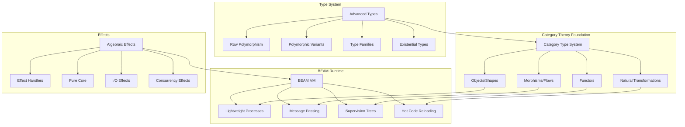

I'll read through all your research documents to create a comprehensive synthesis of the Topos language design. Let me start by fetching and analyzing each document.I need to continue fetching the remaining research documents to provide you with a comprehensive synthesis. Let me get the rest of the files.# Topos Language Guide

## Introduction

Topos is a new functional programming language for the BEAM virtual machine that fundamentally grounds itself in category theory principles. Unlike traditional functional languages that add categorical concepts as libraries, Topos makes category theory the foundation from which all language features emerge naturally. This creates a unique synthesis where mathematical rigor meets practical distributed systems programming.

## Core Philosophy

In Topos, **everything is a category**. Programs are compositions of morphisms (which we call "flows"), data flows through immutable transformations, and side effects are handled through algebraic effect handlers. The language treats the BEAM's actor model as a natural categorical structure, making distributed programming both type-safe and mathematically sound.

## Fundamental Concepts and Keywords

### 1. Shapes (Objects in Category Theory)

Shapes define data types as objects in a category. They are immutable by construction and support algebraic data types.

```topos
-- Product types (records)
shape User = { 
  name: Text, 
  age: Natural,
  email: Email 
} deriving [Eq, Show, Doc]

-- Sum types (variants)  
shape Result a b = Ok a | Error b

-- Recursive types
shape List a = Nil | Cons a (List a)
```

### 2. Flows (Morphisms)

Flows are pure functions that represent morphisms between objects. They compose naturally and preserve categorical properties.

```topos
-- Basic flow definition
flow greet : User -> Text
flow greet user = "Hello, " <> user.name

-- Composition using pipe operator
flow processUser : User -> Result User ValidationError
flow processUser = 
  validate |> normalize |> store
```

### 3. Categories and Modules

Modules organize code into categories with explicit structure.

```topos
category Collections = {
  -- Objects (types)
  export shape List a
  export shape Set a
  
  -- Morphisms (flows)  
  export flow map : (a -> b) -> List a -> List b
  export flow filter : (a -> Bool) -> List a -> List a
  
  -- Laws verified at compile time
  law map_composition : 
    map (f . g) == map f . map g
}
```

### 4. Effects and Handlers

Side effects are managed through algebraic effect handlers, making them explicit in types.

```topos
-- Define an effect
effect FileIO = {
  read : Path -> String,
  write : Path -> String -> Unit
}

-- Use effects with perform keyword
flow loadConfig : Path -> Config / {FileIO}
flow loadConfig path = do
  content <- perform FileIO.read(path)
  return parseConfig(content)

-- Handle effects
handle loadConfig("app.toml") with
  FileIO.read(p) -> readFromDisk(p)
  FileIO.write(p, c) -> writeToDisk(p, c)
end
```

### 5. Actors and Processes

BEAM processes are first-class with categorical structure.

```topos
actor Counter = {
  shape State = { count: Natural }
  shape Message = Increment | Decrement | Get
  
  flow init : Unit -> State
  flow init () = { count: 0 }
  
  flow handle : Message -> State -> (State, Maybe Reply)
  flow handle msg state = match msg
    | Increment -> ({ count: state.count + 1 }, None)
    | Decrement -> ({ count: state.count - 1 }, None)
    | Get -> (state, Some state.count)
  end
}
```

### 6. Pattern Matching

Advanced pattern matching with categorical foundations.

```topos
flow process : Message -> Response
flow process = match
  -- View patterns
  | parse_json -> Ok(data) -> handle_data(data)
  
  -- Or-patterns
  | Error(e) | Failure(e) -> handle_error(e)
  
  -- Pattern guards with bindings
  | Request(data) when validate(data) -> Valid(v) -> 
    process_valid(v)
    
  -- Pattern synonyms
  | Success(result) -> return_success(result)
end
```

### 7. Documentation as First-Class

Documentation is mandatory and introspectable.

```topos
doc "Calculates the distance between two points"
doc params {
  p1: "First point in 2D space",
  p2: "Second point in 2D space"  
}
doc returns "Euclidean distance as Float"
doc examples """
  distance({x: 0, y: 0}, {x: 3, y: 4}) == 5.0
"""
flow distance : Point -> Point -> Float
flow distance p1 p2 =
  sqrt((p2.x - p1.x)^2 + (p2.y - p1.y)^2)
```

### 8. Testing as Language Primitive

Tests are built into the language, not annotations.

```topos
test "distance calculation" =
  let origin = {x: 0, y: 0}
  let point = {x: 3, y: 4}
  assert distance(origin, point) == 5.0

property "distance is symmetric" =
  forall p1 p2 : Point ->
    distance(p1, p2) == distance(p2, p1)
```

### 9. Type System Features

Advanced types with categorical grounding.

```topos
-- Row polymorphism
flow getX : {x: Float | ρ} -> Float
flow getX record = record.x

-- Type families
type family Append xs ys where
  Append [] ys = ys
  Append (x:xs) ys = x : Append xs ys

-- Existential types
shape AbstractSet a = exists r. {
  rep: r,
  empty: r,
  insert: a -> r -> r,
  member: a -> r -> Bool
}
```

### 10. Immutability and Updates

All data is immutable with structured update syntax.

```topos
-- Update with 'with' keyword
flow birthday : User -> User
flow birthday user = 
  user with { age = user.age + 1 }

-- Optics for nested updates
flow updateCity : Text -> Person -> Person
flow updateCity newCity = 
  Person.address.city.set newCity
```

## Complete Syntax Examples

### Session Types for Protocol Safety

```topos
-- Define a session protocol
session TwoPhaseCommit = 
  !prepare -> ?vote -> 
  choice {
    commit -> !finalize -> end,
    abort -> !rollback -> end
  }

-- Implement session
flow coordinator : Session[TwoPhaseCommit] -> Result
flow coordinator session = do
  send session Prepare
  vote <- receive session
  match vote
    | Ready -> 
      select session commit
      send session Finalize
      Ok
    | NotReady ->
      select session abort
      send session Rollback
      Aborted
  end
```

### Functors and Natural Transformations

```topos
-- Define a functor
functor List : Type -> Type where
  map : (a -> b) -> List a -> List b
  
  law identity: map id == id
  law composition: map (g . f) == map g . map f

-- Natural transformation
natural ListToSet : List ~> Set where
  transform : forall a. List a -> Set a
  transform = List.foldl Set.insert Set.empty
  
  law naturality: 
    transform . List.map f == Set.map f . transform
```

### DSL Creation

```topos
-- Define a DSL
dsl MatrixDSL : Category where
  -- Grammar
  grammar Matrix where
    syntax "[[ _ ]]" : Matrix where
      [[ a, b; c, d ]] = Matrix 2 2 [[a,b], [c,d]]
  
  -- Operations
  operator (×) = matrix_multiply
  operator (ᵀ) = transpose [postfix]
  
  -- Laws
  law transpose_multiply:
    (A × B)ᵀ == Bᵀ × Aᵀ
```

## Memory Diagram



## Complete Case Study: Online Store

Let's build a modular online store system demonstrating all of Topos's features.

### Module 1: Core Domain Models

```topos
module Store.Domain where

-- Core shapes with documentation
doc "Represents a product in the catalog"
shape Product = {
  id: ProductId,
  name: Text,
  price: Money,
  stock: Natural
} deriving [Eq, Show, Doc]

doc "Customer information"
shape Customer = {
  id: CustomerId,
  name: Text,
  email: Email,
  address: Address
}

doc "Shopping cart with items"
shape Cart = {
  customer: CustomerId,
  items: List CartItem,
  created: Timestamp
}

shape CartItem = {
  product: ProductId,
  quantity: Natural
}

shape Order = {
  id: OrderId,
  customer: Customer,
  items: List OrderItem,
  total: Money,
  status: OrderStatus
}

shape OrderStatus = 
  | Pending
  | Confirmed
  | Shipped TrackingNumber
  | Delivered
  | Cancelled Reason

-- Type families for calculations
type family TotalPrice items where
  TotalPrice [] = Money 0
  TotalPrice (item:rest) = 
    item.price * item.quantity + TotalPrice rest
```

### Module 2: Effects Definition

```topos
module Store.Effects where

-- Database effect
effect Database = {
  query : Query a -> List a,
  insert : a -> Unit,
  update : Id -> a -> Unit,
  delete : Id -> Unit
}

-- Payment processing effect
effect Payment = {
  charge : Card -> Money -> PaymentResult,
  refund : TransactionId -> Money -> RefundResult
}

-- Email notification effect
effect Email = {
  send : Address -> Template -> Unit
}

-- Inventory management effect
effect Inventory = {
  check : ProductId -> Natural,
  reserve : ProductId -> Natural -> Bool,
  release : ProductId -> Natural -> Unit
}
```

### Module 3: Business Logic (Pure)

```topos
module Store.Logic where
import Store.Domain
import Store.Effects

-- Pure validation functions
doc "Validates a cart has items and all are in stock"
flow validateCart : Cart -> Result Cart ValidationError
flow validateCart cart = do
  ensure (not List.empty cart.items) 
    "Cart cannot be empty"
  
  ensure (all validQuantity cart.items)
    "Invalid item quantities"
    
  Ok cart
where
  validQuantity item = item.quantity > 0

-- Price calculation with row polymorphism
flow calculateTotal : {items: List OrderItem | ρ} -> Money
flow calculateTotal order =
  List.foldl (\acc item -> 
    acc + (item.price * item.quantity)
  ) (Money 0) order.items

-- Order state machine with pattern matching
flow processOrderStatus : OrderStatus -> OrderEvent -> OrderStatus
flow processOrderStatus = match
  | Pending, Confirm -> Confirmed
  | Confirmed, Ship(tracking) -> Shipped(tracking)
  | Shipped(_), Deliver -> Delivered
  | status, Cancel(reason) when cancelable(status) -> 
    Cancelled(reason)
  | status, _ -> status  -- Invalid transitions ignored
end
where
  cancelable = match
    | Pending | Confirmed -> true
    | _ -> false
  end
```

### Module 4: Service Layer with Effects

```topos
module Store.Service where
import Store.Domain
import Store.Logic
import Store.Effects

-- Checkout service with multiple effects
flow checkout : Cart -> Result Order CheckoutError 
  / {Database, Payment, Email, Inventory}
flow checkout cart = do
  -- Validate cart
  validCart <- validateCart cart |> liftResult
  
  -- Check inventory
  available <- all checkStock validCart.items
  ensure available StockUnavailable
  
  -- Reserve items
  reserved <- all reserveItem validCart.items
  ensure reserved ReservationFailed
  
  -- Create order
  let order = createOrder validCart
  perform Database.insert(order)
  
  -- Process payment
  payment <- perform Payment.charge(
    validCart.customer.card, 
    order.total
  )
  
  match payment
    | Success(txn) -> do
      let confirmed = order with { 
        status = Confirmed,
        transaction = txn
      }
      perform Database.update(order.id, confirmed)
      perform Email.send(
        order.customer.email,
        OrderConfirmation(confirmed)
      )
      Ok confirmed
      
    | Failure(reason) -> do
      -- Release reserved inventory
      each (releaseItem) validCart.items
      perform Database.update(order.id, 
        order with { status = Cancelled(reason) })
      Error PaymentFailed(reason)
  end
where
  checkStock item = 
    perform Inventory.check(item.product) >= item.quantity
    
  reserveItem item = 
    perform Inventory.reserve(item.product, item.quantity)
    
  releaseItem item =
    perform Inventory.release(item.product, item.quantity)
```

### Module 5: Actor-Based Order Processing

```topos
module Store.OrderProcessor where
import Store.Domain
import Store.Service

-- Order processing actor with supervision
actor OrderProcessor = {
  shape State = {
    orders: Map OrderId Order,
    metrics: ProcessingMetrics
  }
  
  shape Message = 
    | ProcessOrder Cart
    | UpdateStatus OrderId OrderStatus
    | GetOrder OrderId
    | GetMetrics
  
  flow init : Unit -> State
  flow init () = {
    orders: Map.empty,
    metrics: defaultMetrics
  }
  
  flow handle : Message -> State -> (State, Maybe Reply) 
    / {Database, Payment, Email, Inventory}
  flow handle msg state = match msg
    | ProcessOrder cart -> do
      result <- checkout cart
      match result
        | Ok order -> 
          let newState = state with {
            orders = Map.insert order.id order state.orders,
            metrics = updateMetrics Success state.metrics
          }
          (newState, Some order.id)
          
        | Error e ->
          let newState = state with {
            metrics = updateMetrics (Failure e) state.metrics
          }
          (newState, Some (Error e))
      end
      
    | UpdateStatus id status ->
      let updated = Map.update id 
        (\order -> order with { status = status }) 
        state.orders
      (state with { orders = updated }, None)
      
    | GetOrder id ->
      (state, Map.lookup id state.orders)
      
    | GetMetrics ->
      (state, Some state.metrics)
  end
}

-- Supervisor for order processing
supervisor OrderSupervisor = {
  strategy: one_for_one,
  intensity: 10,
  period: 60,
  
  children: [
    {
      id: order_processor,
      start: OrderProcessor.start_link,
      restart: permanent,
      shutdown: 5000
    }
  ]
}
```

### Module 6: Web API with Session Types

```topos
module Store.API where
import Store.Service

-- Define API session protocol
session CustomerSession =
  ?Login Credentials ->
  choice {
    success -> !Token -> ShoppingSession,
    failure -> !Error -> end
  }

session ShoppingSession = 
  rec X. choice {
    browse -> !Products -> X,
    addToCart -> ?ProductId -> !Result -> X,
    viewCart -> !Cart -> X,
    checkout -> ?PaymentInfo -> CheckoutSession,
    logout -> end
  }

session CheckoutSession =
  !OrderSummary ->
  ?Confirmation ->
  choice {
    confirm -> !Order -> end,
    cancel -> ShoppingSession
  }

-- Implement the API handler
flow handleCustomer : Session[CustomerSession] -> Unit
  / {Database, Http}
flow handleCustomer session = do
  credentials <- receive session
  user <- perform Database.query(
    UserByCredentials(credentials)
  )
  
  match user
    | Some u -> do
      select session success
      token <- generateToken u
      send session token
      handleShopping session u
      
    | None -> do
      select session failure
      send session InvalidCredentials
  end

flow handleShopping : Session[ShoppingSession] -> User -> Unit
  / {Database, Http}
flow handleShopping session user = do
  choice <- receive session
  match choice
    | browse -> do
      products <- perform Database.query(AllProducts)
      send session products
      handleShopping session user
      
    | addToCart -> do
      productId <- receive session
      result <- addToUserCart user productId
      send session result
      handleShopping session user
      
    | viewCart -> do
      cart <- perform Database.query(CartByUser user.id)
      send session cart
      handleShopping session user
      
    | checkout -> do
      payment <- receive session
      handleCheckout session user payment
      
    | logout -> ()
  end
```

### Module 7: Testing

```topos
module Store.Test where
import Store.Service
import Store.Domain

-- Property-based testing for business logic
property "cart total is sum of items" =
  forall items : List CartItem ->
    calculateTotal {items: items} == 
    List.sum (List.map itemTotal items)
  where
    itemTotal item = item.price * item.quantity

-- Effect testing with mock handlers
test "checkout reserves inventory" = do
  let cart = {
    customer: testCustomer,
    items: [{product: pid1, quantity: 2}]
  }
  
  let inventoryOps = ref []
  
  -- Run with mock handlers
  result <- handle checkout(cart) with
    Database.insert(_) -> ()
    Database.update(_, _) -> ()
    
    Payment.charge(_, amount) -> 
      assert amount == Money 200
      Success(txn123)
      
    Email.send(_, _) -> ()
    
    Inventory.check(pid) -> 
      assert pid == pid1
      return 10  -- Plenty in stock
      
    Inventory.reserve(pid, qty) ->
      inventoryOps := (pid, qty) :: !inventoryOps
      return true
  end
  
  -- Verify inventory was reserved
  assert !inventoryOps == [(pid1, 2)]
  assert result matches Ok(_)
end

-- Actor testing
test actor "order processor handles concurrent orders" = do
  let processor = spawn_test OrderProcessor.init()
  
  -- Send multiple orders concurrently
  parallel [
    processor ! ProcessOrder(cart1),
    processor ! ProcessOrder(cart2),
    processor ! ProcessOrder(cart3)
  ]
  
  wait_idle processor
  
  -- Verify all processed
  metrics <- processor ?? GetMetrics
  assert metrics.total == 3
end

-- Benchmark testing
benchmark "checkout performance" = {
  baseline: {
    "simple checkout": 
      measure -> checkout(simpleCart),
    "complex checkout":
      measure -> checkout(complexCart)
  },
  
  requirements: {
    "checkout under 100ms": time < 100.ms,
    "memory usage": heap_growth < 1.mb
  }
}
```

### Module 8: DSL for Business Rules

```topos
module Store.Rules where

-- Define a DSL for business rules
dsl BusinessRules where
  -- Rule definition syntax
  rule FreeShipping =
    when order.total > Money 100
    then order with { shipping = Free }
    
  rule BulkDiscount =
    when any item -> item.quantity >= 10
    then apply discount 0.10 to item
    
  rule LoyaltyPoints =
    when customer.tier == Gold
    then award points (order.total * 0.02)
  
  -- Rule composition
  ruleset StandardRules = 
    FreeShipping >> BulkDiscount >> LoyaltyPoints
  
  -- Interpreter for rules
  interpreter RuleEngine : BusinessRules -> Order -> Order where
    apply rule order = match rule
      | when condition then action ->
        if evaluate condition order
        then execute action order
        else order
    end
```

### Module 9: Main Application

```topos
module Store.Main where
import Store.{OrderProcessor, API, Service}

-- Main application with effect handling
flow main : Unit -> Unit / {}
flow main () = do
  -- All effects must be handled
  handle runApplication() with
    -- Production handlers
    Database.query(q) -> PostgreSQL.execute(q)
    Database.insert(x) -> PostgreSQL.insert(x)
    Database.update(id, x) -> PostgreSQL.update(id, x)
    Database.delete(id) -> PostgreSQL.delete(id)
    
    Payment.charge(card, amount) -> 
      StripeAPI.charge(card, amount)
    Payment.refund(txn, amount) -> 
      StripeAPI.refund(txn, amount)
      
    Email.send(addr, template) ->
      SendGrid.send(addr, render(template))
      
    Inventory.check(pid) ->
      InventoryDB.getStock(pid)
    Inventory.reserve(pid, qty) ->
      InventoryDB.reserve(pid, qty)
    Inventory.release(pid, qty) ->
      InventoryDB.release(pid, qty)
  end

flow runApplication : Unit -> Unit 
  / {Database, Payment, Email, Inventory}
flow runApplication () = do
  -- Start supervision tree
  supervisor OrderSupervisor.start()
  
  -- Start web server
  HttpServer.start(port: 8080) { request ->
    match request.path
      | "/api/session" -> 
        spawn handleCustomer(establishSession())
      | "/health" -> 
        HttpResponse.ok("healthy")
      | _ -> 
        HttpResponse.notFound()
    end
  }
  
  -- Keep running
  Process.sleep(:infinity)
end
```

## Key Language Features Summary

### Category Theory Integration
- **Objects and Morphisms**: Types and functions as categorical structures
- **Functors**: Type constructors with mapping operations
- **Natural Transformations**: Structure-preserving conversions
- **Monads and Comonads**: Computational contexts
- **Limits and Colimits**: Products, coproducts, and universal constructions

### Type System
- **Row Polymorphism**: Extensible records and variants
- **Polymorphic Variants**: Open sum types
- **Type Families**: Type-level computation
- **Singleton Types**: Bridge between types and values
- **Existential Types**: Abstract data types
- **Session Types**: Protocol-safe communication

### Effects and Purity
- **Algebraic Effects**: First-class effect definitions
- **Effect Handlers**: Flexible effect interpretation
- **Pure by Default**: Explicit effect annotations
- **Effect Polymorphism**: Generic over effects
- **Type-Safe I/O**: Effects tracked in types

### Concurrency and Distribution
- **Actor Model**: Type-safe processes
- **Supervision Trees**: Categorical fault tolerance
- **Hot Code Reloading**: Version migration as functors
- **Distributed Types**: Location-transparent computation
- **Choreographic Programming**: Global protocol definitions

### Developer Experience
- **Mandatory Documentation**: Machine-checkable docs
- **First-Class Testing**: Tests as language primitives
- **Property Testing**: Automated law verification
- **Pattern Matching**: Advanced patterns with categorical semantics
- **DSL Creation**: Grammar definition and metaprogramming

### BEAM Integration
- **Process Isolation**: Each actor has independent heap
- **Message Passing**: Type-safe communication
- **Fault Tolerance**: Let-it-crash with types
- **Distribution**: Transparent node communication
- **Performance**: Zero-cost abstractions where possible

## Conclusion

Topos represents a unique synthesis of mathematical rigor and practical distributed systems programming. By making category theory the foundation rather than an addition, it enables developers to write code that is simultaneously:

- **Mathematically Sound**: Verified by categorical laws
- **Practically Useful**: Running on battle-tested BEAM
- **Type Safe**: Catching errors at compile time
- **Concurrent**: Leveraging actors and supervision
- **Testable**: With built-in testing and mocking
- **Maintainable**: Through mandatory documentation and clear effects

The online store example demonstrates how these features work together to create a robust, scalable, and maintainable system that leverages the best of functional programming, category theory, and the BEAM runtime.
